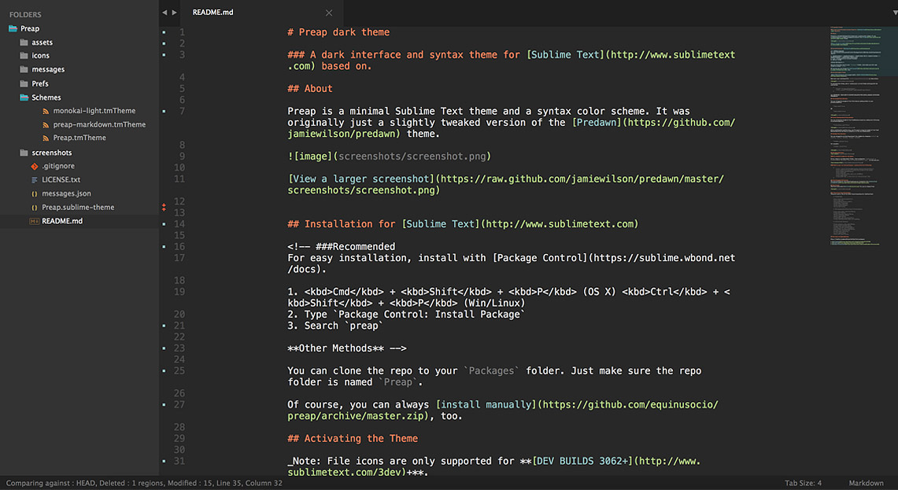
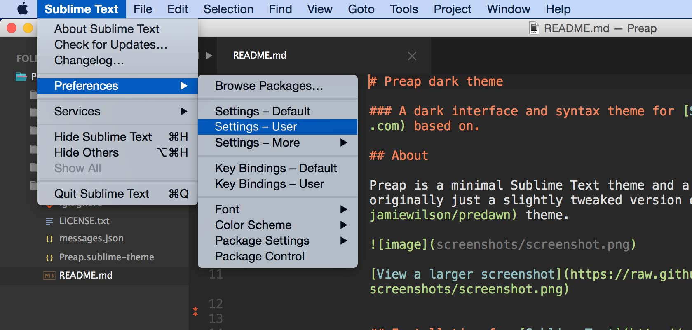
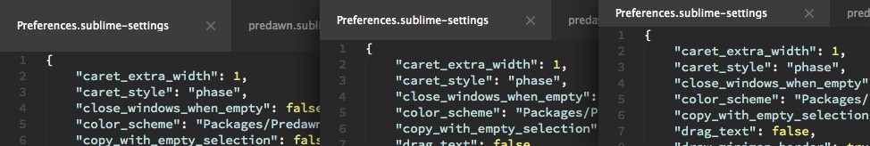
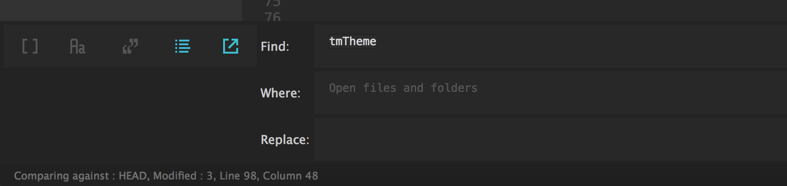
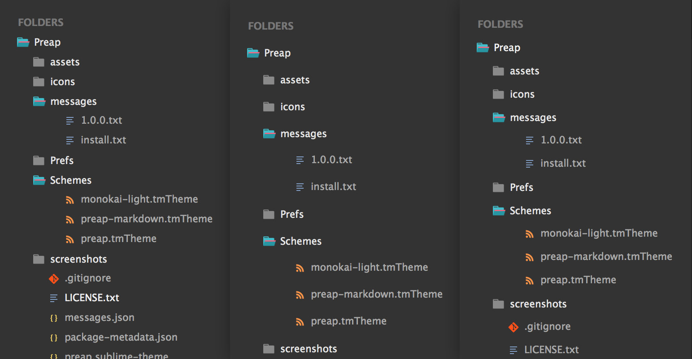
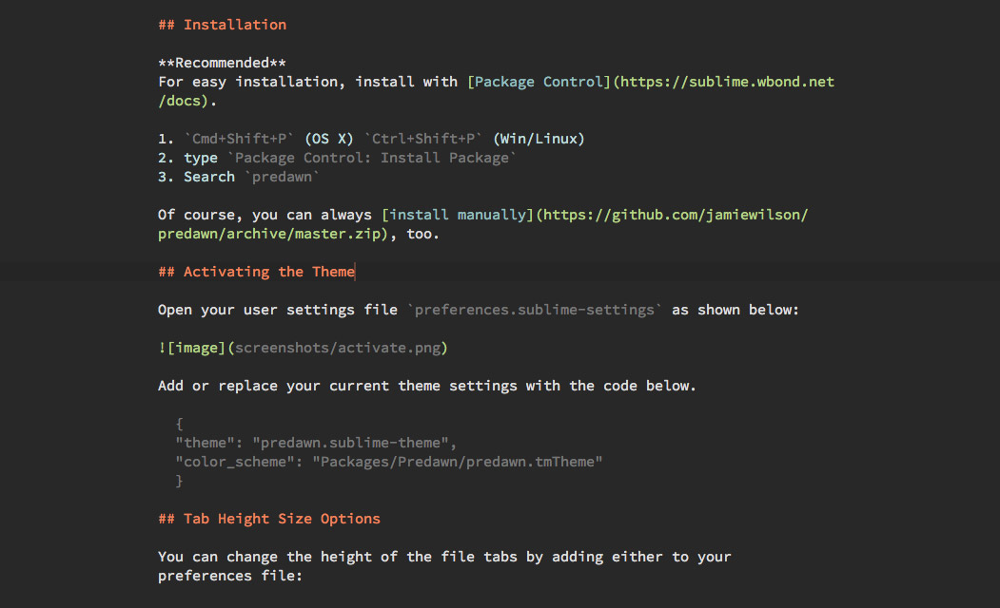

# Preap dark theme

### A dark interface and syntax theme for [Sublime Text](http://www.sublimetext.com).

## About

Preap is a minimal Sublime Text theme and a syntax color scheme. It was originally just a slightly tweaked version of the [Predawn](https://github.com/jamiewilson/predawn) theme. 

[View a larger screenshot](https://raw.githubusercontent.com/equinusocio/preap/master/screenshots/general.jpg)

## Installation for [Sublime Text](http://www.sublimetext.com)

<!-- ###Recommended
For easy installation, install with [Package Control](https://sublime.wbond.net/docs).

1. <kbd>Cmd</kbd> + <kbd>Shift</kbd> + <kbd>P</kbd> (OS X) <kbd>Ctrl</kbd> + <kbd>Shift</kbd> + <kbd>P</kbd> (Win/Linux)
2. Type `Package Control: Install Package`
3. Search `preap`

**Other Methods** -->

You can clone the repo to your `Packages` folder. Just make sure the repo folder is named `Preap`.

Of course, you can always [download zip](https://github.com/equinusocio/preap/archive/master.zip) and install manually, too.

## Activating the Theme

_Note: File icons are only supported for **[DEV BUILDS 3062](http://www.sublimetext.com/3dev)+**._

Open your user settings file `preferences.sublime-settings` as shown below:

To activate the theme, add or replace your current theme settings with the code below.

	{
		"theme": "preap.sublime-theme",
		"color_scheme": "Packages/Preap/Schemes/preap.tmTheme",
	}

*** IMPORTANT - MAKE SURE TO RESTART SUBLIME AFTER INSTALLING AND ACTIVATING PREAP ***

## Tab Height Size Options

You can change the height of the file tabs by adding either to your preferences file:

	"tabs_small": true

OR

	"tabs_medium": true

## Find & Replace Small Size Option

You can change the height of the Find/Replace inputs by adding the following to preferences file:

	"findreplace_small": true

After enabling the smaller size, you'll need to drag the height of the Find/Replace panel up and down to adjust it to the new dimemension.

## Sidebar Size Options

You can change the vertical spacing of the sidebar by changing `default` to `large`, `xlarge`:

	"sidebar_default": true

for example:

	"sidebar_large": true

## Markdown Settings

#### To enable Preap for Markdown

First, **open a markdown(.md) file**, then navigate to `Sublime Text` > `Preferences` > `Settings - More` > `Syntax Specific - User`  in the menu bar.

#### Add to your current settings or replace with the following:

	{
		"color_scheme": "Packages/Preap/preap-markdown.tmTheme",
		"draw_centered": true, // Centers the column in the window
		"draw_indent_guides": false,
		"font_size": 15,
		"trim_trailing_white_space_on_save": false,
		"word_wrap": true,
		"wrap_width": 80  // Sets the # of characters per line
	}

## A few of my favorite options
These are just a few of my other favorite options for Sublime Text:

	// Typography

	"font_face": "Consolas",
	"font_size": 14,
	"font_options": ["no_round"],
	"highlight_line": true,
	"caret_extra_width": 1,
	"caret_style": "phase",
	"word_wrap": false,

	// Whitespace, Matching, Copy & Auto-Complete

	"copy_with_empty_selection": false,
	"drag_text": false,
	"match_brackets_content": false,
	"match_selection": false,
	"match_tags": false,
	"translate_tabs_to_spaces": true,
	"trim_trailing_white_space_on_save": true,

	// Interface & Behavior

	"close_windows_when_empty": false,
	"draw_minimap_border": true,
	"enable_tab_scrolling": false,
	"overlay_scroll_bars": "enabled",
	"open_files_in_new_window": false,
	"preview_on_click": false,
	"scroll_past_end": true,
	"scroll_speed": 5.0,
	"show_full_path": false,

## And some recommendations

Also, I highly recommend these Sublime Text packages:

* [Sublime-CSS3](https://github.com/i-akhmadullin/Sublime-CSS3)  
* [GitGutter](https://github.com/jisaacks/GitGutter)  
* [Sidebar Enhancements](https://github.com/titoBouzout/SideBarEnhancements)  
 